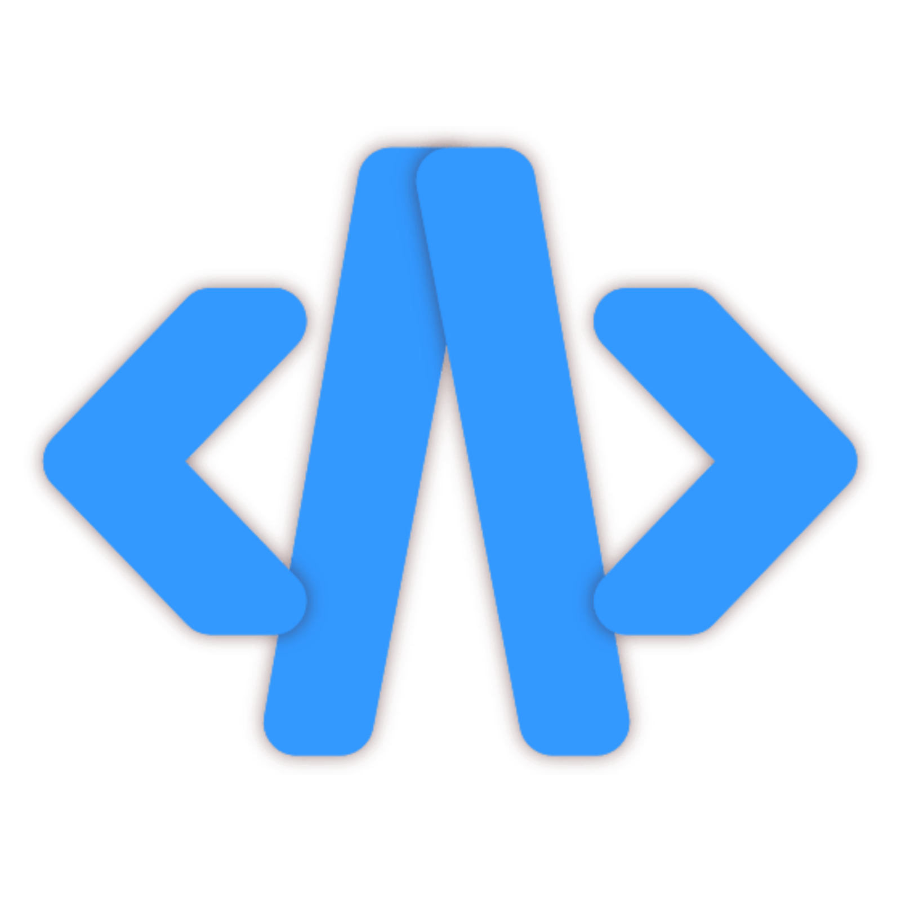

# Acode — AI-Powered Code Editor for Android

<p align="center">
  
</p>

Acode is a full-featured code editor for Android with integrated AI coding assistance powered by OpenClaude. Edit code on your mobile device, get AI help with debugging, refactoring, and code generation — all through a natural chat interface.

## Features

### Code Editing
- Syntax highlighting for 100+ languages
- Multiple cursors and advanced editing
- Built-in file browser and terminal
- Git integration
- Community plugin ecosystem

### AI Integration (Phases 1–4)
- **Chat Interface** — Sidebar panel for natural conversation with an AI coding assistant
- **Streaming Responses** — Real-time token-by-token display as the AI generates code
- **Tool Execution** — AI can read files, write files, list directories, and execute commands
- **Patch Flow** — AI proposes changes as diffs; you review and approve before they're applied
- **Conflict Resolution** — Automatic detection when patches conflict with local changes, with ours/theirs/merge resolution
- **Undo Support** — Revert any AI-applied patch from history
- **Context Collection** — Automatically gathers project structure and relevant files for the AI
- **Token Tracking** — Monitor usage and costs across sessions
- **Conversation History** — Persisted conversations with search and management
- **Auto-Reconnect** — WebSocket connection recovers automatically from drops
- **Settings UI** — Configure model, API key, token limits, and more
- **Connection Status** — Real-time indicator of AI backend connectivity

## Architecture

```
┌─────────────────────────────────────────────────┐
│  Acode Android App (Cordova WebView)            │
│  ┌──────────┐  ┌──────────┐  ┌───────────────┐ │
│  │ Chat UI  │  │  Status  │  │ Patch Dialog  │ │
│  │ sidebarApps/ai/ │  │  indicator  │  │ + Diff Viewer │ │
│  └────┬─────┘  └────┬─────┘  └───────┬───────┘ │
│       │ WebSocket    │                │          │
│  ─────┴──────────────┴────────────────┴───────  │
│  Node.js Server (src/ai/)                       │
│  ┌──────────┐  ┌──────────┐  ┌───────────────┐ │
│  │ Message  │  │  Patch   │  │   Conflict    │ │
│  │ Router   │  │ Manager  │  │   Resolver    │ │
│  └────┬─────┘  └────┬─────┘  └───────┬───────┘ │
│       │              │                │          │
│  ┌────┴──────────────┴────────────────┴───────┐ │
│  │         OpenClaude CLI Process              │ │
│  └────────────────────────────────────────────┘ │
└─────────────────────────────────────────────────┘
```

### Backend Modules (`src/ai/`)

| Module | Purpose |
|--------|---------|
| `server.js` | WebSocket server, client management |
| `messageRouter.js` | Routes messages between UI and OpenClaude |
| `openClaudeManager.js` | Spawns and manages Claude CLI process |
| `contextCollector.js` | Gathers project files and structure for prompts |
| `toolExecutor.js` | Executes tool calls (read, write, list, command, patch) |
| `patchManager.js` | Queues and applies patches with approval flow |
| `patchHistory.js` | Undo support for applied patches |
| `conflictResolver.js` | Detects and resolves patch conflicts |
| `diffViewer.js` | Parses and renders unified diffs as DOM elements |
| `patchDialog.js` | Patch review dialog with accept/reject buttons |
| `tokenManager.js` | Tracks token usage and cost |
| `settings.js` | Manages AI configuration |
| `conversationStore.js` | Persists conversation history |
| `terminalBridge.js` | Terminal integration bridge |
| `websocket.js` | Client-side WebSocket connection |

### Frontend (`src/sidebarApps/ai/`)

| File | Purpose |
|------|---------|
| `chat.js` | Chat UI components and message rendering |
| `index.js` | Sidebar app registration |
| `status.js` | Connection status indicator |
| `style.scss` | AI panel styling |

## Development

### Prerequisites

- Node.js 20+
- Android SDK (for APK builds)
- OpenClaude CLI installed and accessible

### Quick Start

```bash
# Clone the repository
git clone https://github.com/rahul0113/code.git
cd code

# Install dependencies
npm ci

# Run tests
npm test

# Run linter
npm run lint

# Build the web assets
npm run build
```

### Building APK

```bash
# Install Cordova
npm install -g cordova

# Add Android platform
npx cordova platform add android

# Build debug APK
npx cordova build android --debug
```

### Running Tests

```bash
# Run all tests
npm test

# Run tests in watch mode
npm run test:watch

# Run specific test file
npx vitest run tests/integration/ai.test.js
```

### Project Structure

```
src/
├── ai/                 # AI integration backend
├── sidebarApps/ai/     # AI chat UI
├── lib/claude/         # Claude CLI utilities
├── cm/                 # CodeMirror editor
├── lang/               # Language files
└── plugins/            # Cordova plugins

tests/
├── unit/               # Unit tests
├── integration/        # Integration tests
└── __mocks__/          # Test mocks
```

## CI/CD

This project uses GitHub Actions for continuous integration and release automation:

- **CI** — Runs lint, tests, and build verification on every push and PR
- **Release** — Builds signed APK on tagged releases and uploads as GitHub Release asset

See `.github/workflows/` for the full pipeline configuration.

## License

MIT License — Copyright (c) 2020 Foxdebug (Ajit Kumar)

See [license.txt](license.txt) for the full license text.

## Contributing

See [CONTRIBUTING.md](CONTRIBUTING.md) for development setup and contribution guidelines.
